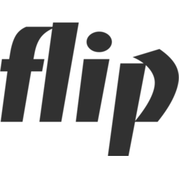

 

 [Check live wasm samples](https://guillaumeblanc.github.io/flip/). 

Flip is a multi-platform 3D programming library designed to simplify the development of basic 3d rendering and viewing applications.

Flip is built on top of [Sokol](https://github.com/floooh/sokol) and [Dear ImGui](https://github.com/ocornut/imgui). It doesn't hide those libraries, but instead exposes them. This approach avoids the addition of a new abstraction layer, allowing for more advanced 3D rendering capabilities to be readily accessible.

Flip currently implements 3D rendering with OpenG and OpenGL ES, which could be extended to other APIs thanks to Sokol HAL.

flip supports all major operating systems, and treats WebAssembly has a 'first-class citizen'. You can explore HTML samples [here](https://guillaumeblanc.github.io/flip/). 

# Getting started

## Cloning

## Building

## Cross compiling for the web

